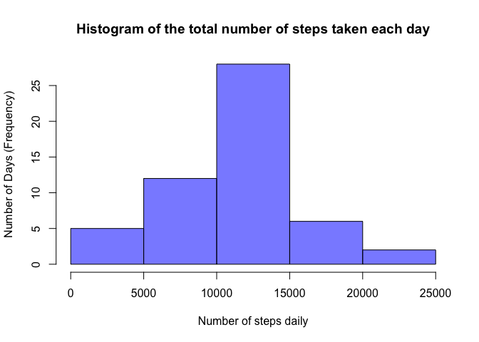
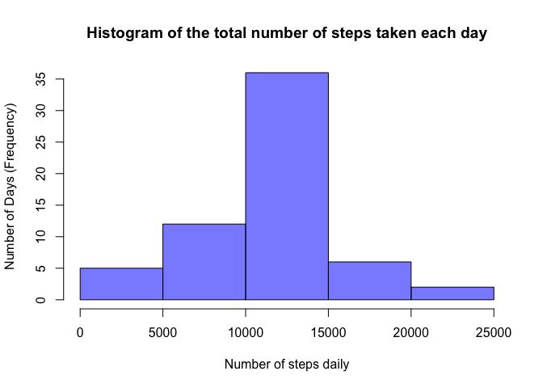
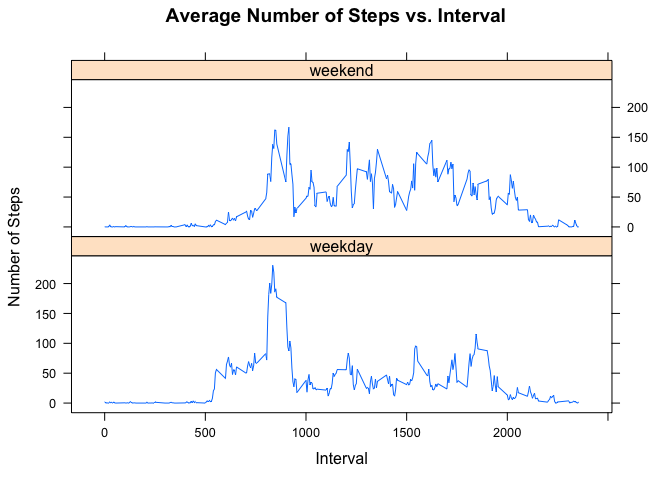

# Reproducible Research: Peer Assessment 1


## Loading and preprocessing the data
Data are first loaded into the workspace using load csv command and additional 
processing to change date columns from char into date. The loaded dataset
consists of 17568 rows & 3 columns (interval, date and steps)

```r
dataset <- read.csv("activity.csv",header=T, sep=',', stringsAsFactors=F, 
                    comment.char="",na.strings = "NA")
dataset$date <- as.Date(dataset$date)
```

## What is mean total number of steps taken per day?
1. Make a histogram of the total number of steps taken each day
  Number of steps taken are first aggregated to each date - ignoting any missing
  values. Base plot of histogram is made from the aggregated results


```r
dailysteps <- aggregate(steps ~ date, data=dataset, sum)
hist(dailysteps$steps, 
     main="Histogram of the total number of steps taken each day"
     , xlab = "Number of steps daily", ylab = "Number of Days (Frequency)"
     , col="#0000FF88")
```

 

2. Calculate and report the mean and median total number of steps taken per day

Daily mean

```r
mean(dailysteps$steps)
```

```
## [1] 10766.19
```
Daily median

```r
median(dailysteps$steps)
```

```
## [1] 10765
```

## What is the average daily activity pattern?
1.  Make a time series plot (i.e. type = "l") of the 5-minute interval (x-axis) and the average number of steps taken, averaged across all days (y-axis)

```r
avgsteps <- aggregate(steps ~ interval, data=dataset, mean, na.rm=T)
plot(x=avgsteps$interval, y=avgsteps$steps, type="l", 
     main="Time Series Plot of the 5-minute Interval", 
     xlab="5-minute time interval",ylab="average number of steps taken")
```

 

2. Which 5-minute interval, on average across all the days in the dataset, 
contains the maximum number of steps?
The interval 835 contains the maximum number of steps when averaged across all 
the days in the dataset

```r
avgsteps[avgsteps$steps == max(avgsteps$steps), ]
```

```
##     interval    steps
## 104      835 206.1698
```

## Inputing missing values
1. Calculate and report the total number of missing values in the dataset
(i.e. the total number of rows with NAs)


```r
sum(!complete.cases(dataset))
```

```
## [1] 2304
```

2. Devise a strategy for filling in all of the missing values in the dataset. 
The strategy does not need to be sophisticated. For example, you could use the 
mean/median for that day, or the mean for that 5-minute interval, etc.

Missing data in the original dataset would be replaced with the mean for that
5-minute interval. Due to the variation of activities/number of steps taken
throughout the day, this strategy would be able to represent daily trend better
than single values of mean or median.

3. Create a new dataset that is equal to the original dataset but with the 
missing data filled in.


```r
new_ds <- dataset
new_ds$steps <- ifelse(is.na(new_ds$steps), 
                        avgsteps$steps[match(new_ds$interval, avgsteps$interval)],
                       new_ds$steps)
```

4. Make a histogram of the total number of steps taken each day and Calculate 
and report the mean and median total number of steps taken per day. Do these 
values differ from the estimates from the first part of the assignment? 
What is the impact of imputing missing data on the estimates of the total daily 
number of steps?

Histogram with estimation of any missing data

```r
new_dailysteps <- aggregate(steps ~ date, data=new_ds, sum)
hist(new_dailysteps$steps, 
     main="Histogram of the total number of steps taken each day"
     , xlab = "Number of steps daily", ylab = "Number of Days (Frequency)"
     , col="#0000FF88")
```

 
     
Mean

```r
mean(new_dailysteps$steps)
```

```
## [1] 10766.19
```
Both old dataset where missing data are ignored and new dataset are giving 
the same value of 10766.19 for mean. No differences observed on the mean of 
these two dataset

Median

```r
median(new_dailysteps$steps)
```

```
## [1] 10766.19
```
Median value calculated from old dataset where missing data are ignored is 10765
while new dataset are having median value of 10766.19. Slightly higher value of
median in the new dataset.

## Are there differences in activity patterns between weekdays and weekends?
1. Create a new factor variable in the dataset with two levels – “weekday” 
and “weekend” indicating whether a given date is a weekday or weekend day.

For this purpose. the library timeDate would be loaded in order to utilised the 
isWeekday() function. 

```r
library(timeDate)
```

The new columns created will then be converted into factor


```r
library(plyr)
new_ds <- mutate(new_ds, WeekDay 
                 = ifelse(
                     isWeekday(as.POSIXct(new_ds$date,origin = "1960-01-01"))
                     ,"weekday" , "weekend"))
new_ds$WeekDay <- as.factor(new_ds$WeekDay)      
```

2. Make a panel plot containing a time series plot (i.e. type = "l") of the 
5-minute interval (x-axis) and the average number of steps taken, averaged 
across all weekday days or weekend days (y-axis). The plot should look something
like the following, which was creating using simulated data:

In order to create the graph, an mean of number of steps are first made
on the new datas aggregated by Weekday and interval 

```r
weekday_avg <- aggregate(new_ds$steps, 
                         list(interval = new_ds$interval,
                              WeekDay = new_ds$WeekDay), data=new_ds, 
                         FUN=mean)
names(weekday_avg)[3] <- "steps"
```

For the purpose of creating this plot, the lattice library is used and need to 
be loaded before xyplot.

```r
library(lattice)
xyplot(weekday_avg$steps~weekday_avg$interval|weekday_avg$WeekDay, 
       scales=list(cex=.8, col="black"),
       xlab="Interval", ylab="Number of Steps", 
       main="Average Number of Steps vs. Interval",
       type = "l",
       layout=(c(1,2)))
```

 

In comparison between weekdays and weekend trend, the average number of steps in
weekend varies between 0 - 200 throughout the day. Where as for weekday, number 
of steps taken started to increase around 540 interval - and continued to peak 
835 interval - 230 steps.  
